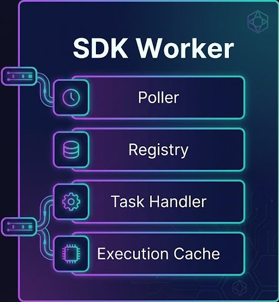
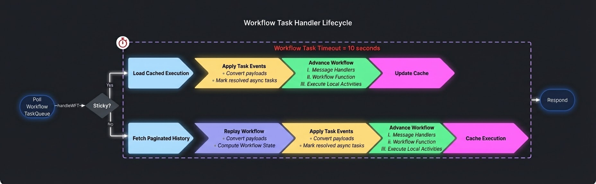

# Workers

# Workers

Workers are the scalable, host-independent processes that execute your Workflow and Activity code. This guide provides best practices, architectural fundamentals, and tuning strategies for deploying efficient Temporal Workers.
## Worker Components

## Index of Categories

### 1. [Best Practices](#1-best-practices)
- [Tune Workers According to Workload](#tune-workers-according-to-the-workload)
- [Horizontal over Vertical Scaling](#horizontal-over-vertical-scaling)
- [Separation of Concerns](#separation-of-concerns)

### 2. [Worker Fundamentals](#2-worker-fundamentals)
- [Task Fundamentals](#task-fundamentals)
- [Internal Components](#internal-components)

### 3. [Operational Considerations](#3-operational-considerations)
- [Workflow Task Timeouts](#workflow-task-timeouts)
- [Deadlock Detection](#deadlock-detection)

### Additional Sections
- [Additional Resources](#additional-resources)
- [Summary](#summary)

---

## 1. Best Practices

### Tune Workers According to the Workload

**Description**: Often, you want to isolate certain types of work onto specific compute resources using dedicated Task Queues. This prevents high-latency activities from starving high-priority workflow logic.

**Best Practices**:
* **Isolate Activities**: Place expensive or security-sensitive activities on their own `TaskQueue`.
* **Activity-Only Workers**: Set `max concurrent workflow task pollers` to `0` for workers handling expensive activities. This prevents wasteful poll connections to the Temporal service and ensures compute is dedicated to activity execution.
* **Workflow-Only Workers**: For high-volume workloads (Signals, Updates, Queries), set `max concurrent activity task pollers` to `0`. This avoids resource contention between long-running activities and time-sensitive workflow state transitions.

**Use Cases**:
* Protecting downstream services via rate-limited Activity Task Queues.
* High-throughput messaging environments requiring dedicated query capacity.
* Meeting specific security boundary requirements for PII-handling activities.

---

### Horizontal over Vertical Scaling

**Description**: Strategies for scaling worker capacity to handle increased load.

**Best Practice**:
* **Prefer Horizontal Scaling**: It is generally more effective to have many smaller compute instances rather than a few large ones.
* **Reasoning**: gRPC overhead and SDK-level locking (especially in sandbox environments) can saturate a single worker's resources even if CPU utilization appears low.

---

### Separation of Concerns

**Description**: Structuring workers based on the role they play in the execution lifecycle.

**Best Practice**:
* **Simplify Tuning**: Allow workers to use as much available compute as possible. Avoid co-locating workers with other resource-intensive non-Temporal services on the same instance.
* **Sandbox Awareness**: Develop Workflow Workers with an awareness of SDK Sandbox peculiarities, ensuring that workflow logic remains deterministic and isolated.

---

## 2. Worker Fundamentals

### Task Fundamentals

**Description**: Tasks are the fundamental units of work sent from the Temporal Cluster to Workers.

## Task Lifecycle

**Key Concepts**:
* **The Task**: The specific "to-do" item (Workflow Task or Activity Task).
* **Task Queues**: The routing mechanism used to distribute tasks to available workers.
* **Sticky Queues**: An optimization that pins a workflow's tasks to a specific worker to leverage the execution cache.

## Worker - Task Queue Interactions

---

### Internal Components

**Description**: A Temporal Worker consists of several internal services working in tandem to process tasks efficiently.

**Core Components**:
* **Task Pollers**: Services that actively long-poll the Temporal Cluster for work.
* **Task Handlers**: The execution logic that runs your Workflow or Activity code.
* **Execution Cache**: A local memory cache that stores the state of recently active workflows to minimize replay overhead.
* **Slot Supplier / Resource Tuner**: Mechanisms used to dynamically manage how many tasks a worker can handle based on system resources.

---

## 3. Operational Considerations

### Workflow Task Timeouts

**Description**: Understanding why a Workflow Task might fail to complete within the specified timeout (default: 10 seconds).

**Common Causes**:
* **Expensive Data Converters**: High overhead during data serialization/deserialization.
* **Compute-Intensive Logic**: Workflow code that takes too long to execute (e.g., heavy looping or complex calculations).
* **Insufficient Capacity**: The worker is overwhelmed and cannot allocate a thread/slot to the task in time.

---

### Deadlock Detection

**Description**: Identifying and preventing deadlocks in Workflow code.

All handlers have **one second** to execute and yield back to the Worker.
Violation of this will cause a `context deadline exceeded` error.

This is noted here in the `Workers` section because this deadlock often does not appear until the Worker has been put under load.
So while this is a Workflow design problem, the Worker can suffer due to this detector failing Workflow Tasks.

**Best Practices**:
* **Note**: A Deadlock is not the same as a Timeout. Deadlocks are often caused by blocking calls or non-deterministic I/O.
* **Avoid Standard Library Mutexes**: Use Temporal-provided primitives for synchronization to ensure determinism.
* **Detection**: Typically identified by a `context deadline exceeded` error.
* **Debugging**: Use `TEMPORAL_DEBUG=1` (or SDK equivalent) in development to disable the deadlock detector and allow for stepping through code with a debugger.

---

## Additional Resources

- [Temporal Workers Documentation](https://docs.temporal.io/workers)
- [Task Queue Management](https://docs.temporal.io/task-queue)
- [Worker Performance Tuning](https://docs.temporal.io/develop/worker-performance)

---

## Summary

**Essential Best Practices**:
1. **Isolate Workloads**: Use dedicated workers for Activities vs. Workflows to prevent resource starvation.
2. **Scale Horizontally**: More small workers are better than fewer large ones to overcome gRPC and locking bottlenecks.
3. **Control Concurrency**: Use `Slot Suppliers` and `max concurrent pollers` to tune workers to their specific host environment.
4. **Monitor for Deadlocks**: Ensure no non-deterministic I/O or standard threading blocks the workflow event loop.
