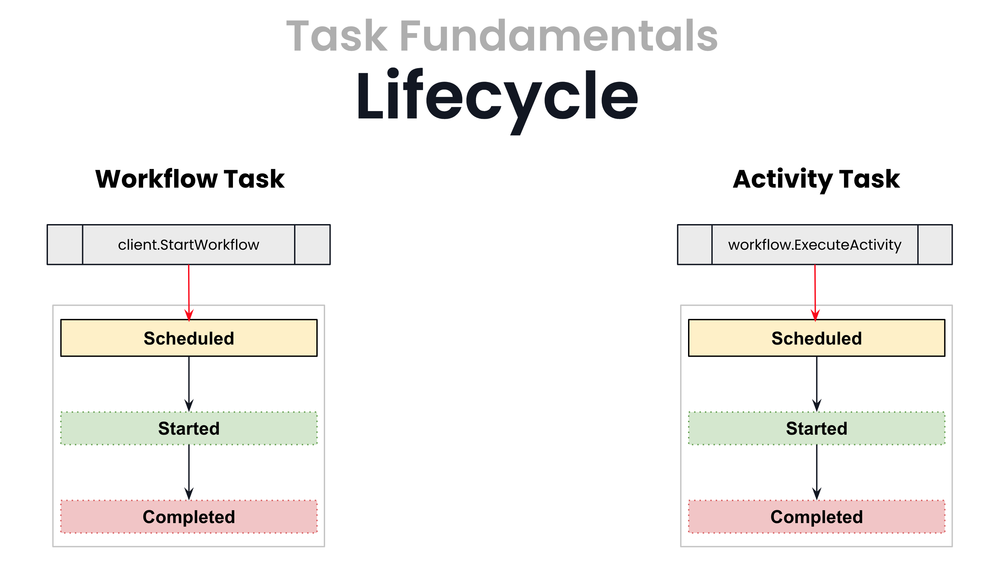
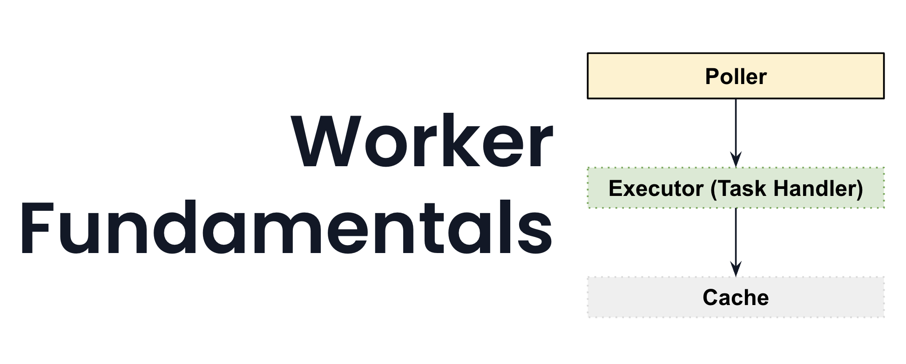

# Workers

## Goals

- Introduce the Temporal Worker
- Review Task Fundamentals
- Understand high level about Executors and Pollers to guide Worker configuration and deployment
- Discuss Best Practices
- Run the Worker with our Workflow and Activity registered

## Task Fundamentals

## Worker Fundamentals

## Best Practices

### Tune Workers According To The Work They Do

Often you want to isolate certain types of work onto specific Compute using its own TaskQueue.

#### Activity Workers
This is very common with Activities that perform expensive work. 
Avoid diminishing resources available to other traffic by taking these steps:
1. Schedule this work on its own `TaskQueue`.
2. Limit the **max concurrent activities** on Workers servicing this TaskQueue to protect its own consumption.
3. Set **max concurrent workflow task pollers** to `0` to turn these Workers into "activity-only workers".
   1. This cuts off any Workflow task concerns in these Workers and prevents wasteful poll connections to Temporal service.

#### Workflow Workers

Workflow Tasks are not just used for executing the Workflow body, they also schedule Queries, Signals, & Updates. 
There are several reasons for running a dedicated "Workflow Worker":
1. High Volume Workload Profile:
   1. Signals and Updates themselves require obtaining locks for their own isolated handling.
   2. Queries must replay your entire Execution without having the same Sticky Queue guarantees of optimization. 
2. You may want to have dedicated Workers to serve these Workflow Tasks to avoid contention for resources. 
3. Some SDKs have other constraints on Workflow Task Execution that might also qualify Workflow Workers.

A Workflow Worker is simply any Worker that does not poll for Workflow Tasks.
To configure this, set **max concurrent activity task pollers** to `0`.

